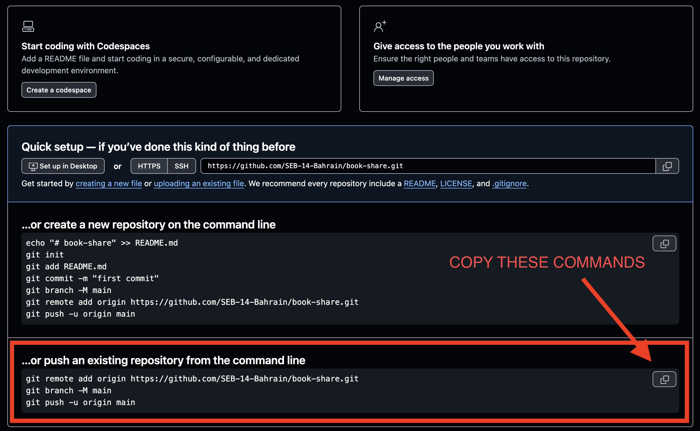

<h1>
  <span class="headline">Build Guide</span>
  <span class="subhead">Setup</span>
</h1>


## 1. Think of a project name - DON'T MAKE A FOLDER FOR IT YET!

For example:

```plaintext
book-share
```

## 2. Clone the Session Auth Template

Go into the `projects` folder:

```bash
cd ~/code/ga/projects
```

Copy the [HTTPS URL from the Session Auth Template repository](https://github.com/SEB-14-Bahrain/men-auth-template).

Use `git clone`, and put your project name at the end (ex: `book-share`) 👇:

```bash
git clone https://github.com/SEB-14-Bahrain/men-auth-template.git book-share
```

The folder is created with your project's name.

Move into the new project folder:

```bash
cd book-share
```

> 🚨 Make sure you are inside your new project folder before running the next commands.


## 3. Remove the template's Git tracking

The cloned project is still connected to the original template repository.

**Remove the old `.git` folder:**

```bash
rm -rf .git
```

> 🚨 Run this command only after confirming that you are inside your new project folder.

You should no longer see `(main)` in your terminal.

## 4. Start a new local Git repository

**Initialize a new Git repository:**

```bash
git init
git add .
git commit -m "Initial project setup"
```

Your project now has its own local Git history.

## 5. Create a new GitHub repository

**On GitHub.com create an empty repository**

GitHub will display instructions for connecting your local project to the new repository.

Find the commands for pushing an existing repository.  Copy those commands and run them in your project folder.




## 6. Install the project packages

**Check that `.env` and `nod_modules` are listed inside `.gitignore`:**

```plaintext
.env
node_modules
```

Install the packages:

```bash
npm install
```


## 7. Update the project name _(optional)_

Open `package.json`.

Change the `"name"` value so it matches your new project:

```json
{
  "name": "book-share"
}
```


## 8. Set up the environment variables

Create a `.env` file if the template does not already include one:

```bash
touch .env
```

Add your MongoDB connection string and session secret:

```plaintext
MONGODB_URI=your_mongodb_connection_string
SESSION_SECRET=your_session_secret
```

Random string generator:
```bash
node -e "console.log(require('node:crypto').randomBytes(32).toString('hex'))"
```


## 9. Test the application

```bash
nodemon server.js
```

Open the application in your browser:

```plaintext
http://localhost:3000
```

Confirm that you can:

* listen on PORT 3000 (or whichever port you are using)
* connect to MongoDB
* open the landing page
* create a user account
* sign in
* sign out

Make an initial push after confirming that the project works:

```bash
git add .
git commit -m "Confirm auth template setup"
git push
```

Your project setup is now complete.